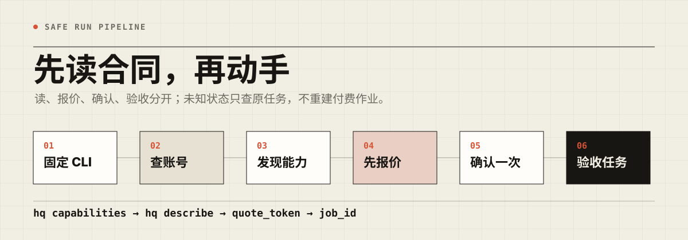
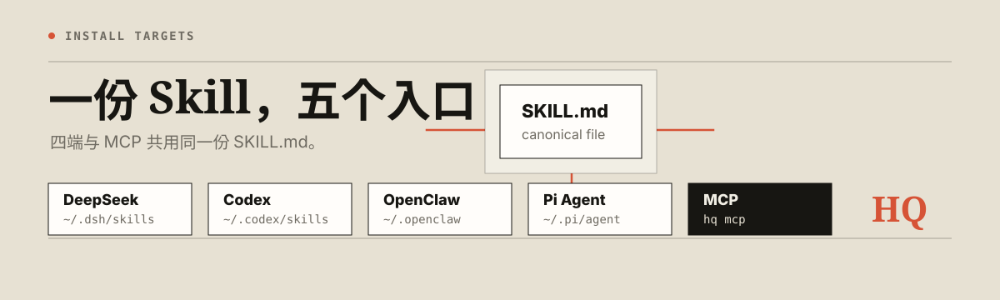

<p align="center">
  
</p>

# Huangque Agent Skill

**中文** | [English](#english)

让 DeepSeek Harness、Codex、OpenClaw 和 Pi Agent 安全调用黄雀 CLI，并通过同一份能力清单提供标准 MCP 工具。

<p align="center">
  
</p>

<p align="center">
  
</p>

## 这是什么

- [`huangque-cli`](https://github.com/tang730125633/huangque-cli) 是执行层：鉴权、能力目录、参数校验、报价、确认、任务和结果。
- 本仓库是 Agent 层：一份核心 `SKILL.md`、四个安装入口、MCP 兼容信息和版本合同。
- 不在这里复制黄雀服务端实现，也不维护四份不同的 Skill。

## 快速安装

CLI 0.12.0 起统一安装并提供 MCP：

```sh
hq skill install deepseek
hq skill install codex
hq skill install openclaw
hq skill install pi
hq skill install mcp
```

重复运行同一命令会检查版本并更新受管安装。已有但不受管的同名 Skill 不会被静默覆盖。

## 支持入口

| 入口 | 安装目标 |
| --- | --- |
| DeepSeek Harness | `~/.dsh/skills/use-huangque-cli` |
| Codex | `~/.codex/skills/use-huangque-cli` |
| OpenClaw | `~/.openclaw/skills/use-huangque-cli` |
| Pi Agent | `~/.pi/agent/skills/use-huangque-cli` |
| MCP | `hq mcp`，每项黄雀能力映射为独立工具 |

## Agent 安全合同

1. 先固定同一个 `hq` 可执行文件，并运行 `hq version --json`。
2. 账号相关任务先运行 `hq status --json`，未授权时让用户完成 `hq login --json`。
3. 能力、字段、价格、限制、供应商和任务状态都以实时发现为准：

```sh
hq capabilities --json
hq describe <capability> --json
```

4. 查询、预览和报价可直接执行；扣费、采集、生成、覆盖和上传必须明确确认。
5. 付费动作先报价，展示费用；用户同意后只用同一份输入加 `--confirm --quote-token <quote_token>` 提交一次。
6. 未知状态的创建任务不得自动重试；保留原 `request_id`、`job_id`、`quote_token` 并查询原任务。
7. MCP 不提供任意终端命令入口。
8. 仓库不保存 Token、Cookie、客户数据或黄雀服务端秘密。

## 模板成片示例（单条 / 批量）

先读取实时可用的模板和输入合同；不要在文档或提示中保存模板 ID、字体或价格。

```sh
hq run matrix-template-capability --json
hq run matrix-template-templates --json

# 单条：按 live describe 写入 single.json；template_id 和可选 font_family 来自上一步
hq describe matrix-template-generate --json
hq run matrix-template-generate --input @single.json --json
hq run matrix-template-generate --input @single.json --confirm --quote-token <quote_token> --json

# 批量：按 live describe 写入 batch.json，并将 count 设为 2-5
hq describe matrix-template-batch-generate --json
hq run matrix-template-batch-generate --input @batch.json --json
hq run matrix-template-batch-generate --input @batch.json --confirm --quote-token <quote_token> --json
```

每个单条或批量请求只报价一次、确认一次。保存全部返回的 `job_ids` 和原 `quote_token`；若批量部分成功或状态未知，保留已接受任务并按返回的结构化恢复指引处理，不能新建一批重试。

## B 站采集示例

```sh
hq describe collect-content --json
printf '%s' '{"url":"<BILIBILI_URL>"}' | hq run collect-content --input @-
```

第一条运行只取得服务端报价。只有用户明确同意报价后，才可用完全相同的输入加上 `--confirm --quote-token <quote_token>` 提交。

## 版本合同

版本和适配目标以 [`manifest.json`](manifest.json) 为准。

| 项目 | 当前值 |
| --- | --- |
| Skill | `0.1.1` |
| CLI 最低支持 | `0.10.2` |
| CLI 已测试 / 最新 / 安装器目标 | `0.12.0` |
| MCP 最低 CLI | `0.12.0` |

Skill 只使用实时发现中存在的能力。Skill 独立发布，CLI 升级后重新校验兼容性，不强制共用版本号。

## 开发验证

```sh
python3 scripts/build_manifest.py --check
python3 -m unittest discover -s tests -v
```

## English

Huangque Agent Skill is the public Agent-layer contract for safely using the Huangque `hq` CLI from DeepSeek Harness, Codex, OpenClaw, Pi Agent, and MCP.

- `huangque-cli` remains the execution layer for authentication, live capability discovery, validation, quotes, confirmation, jobs, and results.
- This repository ships one canonical `SKILL.md`, managed install targets, MCP compatibility metadata, and immutable file hashes.
- Agents must discover the live contract with `hq capabilities --json` and `hq describe <capability> --json`; they must not guess undocumented fields, prices, providers, or limits.
- Paid or externally mutating actions require a quote first, explicit user approval, then one confirmed submission with the same input and `quote_token`.

MIT License
